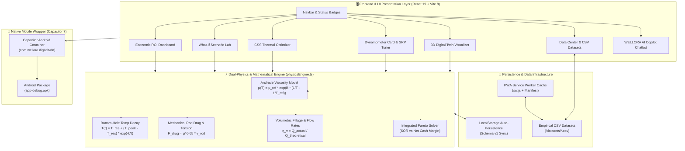

# ⚡ WELLORA — Heavy Crude Digital Twin & Dual-Physics AI System

<div align="center">


**Next-Generation Dual-Physics Optimization System for Thermal EOR (Cyclic Steam Stimulation) & Artificial Lift (Sucker Rod Pump)**

*Calibrated on Jodhpur Sandstone Heavy Oil Formation, Rajasthan, India*

[features](#-key-features--core-modules) • [architecture](#-system-architecture) • [physics](#-physics--mathematical-models) • [installation](#-getting-started--installation) • [mobile-apk](#-mobile-application--android-apk)

</div>

---

## 📌 Executive Summary

**WELLORA** is an integrated, physics-informed digital twin application engineered for ultra-heavy crude oil fields characterized by high initial fluid viscosity (3,200 cP at 47°C) and severe operational anomalies such as **Rod Floating** and **Viscous Drag**.

By coupling **Andrade thermodynamic viscosity models**, **downhole thermal decay dynamics**, **wave-equation sucker rod pump (SRP) load mechanics**, and an **interactive Gemini/Copilot-style AI Reasoning Assistant**, WELLORA enables petroleum engineers to model, diagnose, and optimize well-to-surface production in real time across **Web Browsers**, **Desktop Services**, and **Native Android Smartphones (APK)**.

---

## 🏗️ System Architecture



---

## 🚀 Key Features & Core Modules

### 1. 🖥️ 3D Digital Twin Visualizer
* **Surface Pumping Unit**: Animated 3D walking beam pumping unit operating in real-time sync with SPM settings.
* **Underground Thermal Chamber**: Visual temperature gradient mapping the steam core downhole ($295^\circ\text{C}$) to ambient rock ($47^\circ\text{C}$).
* **Live Telemetry Gauges**: Real-time readouts for Bottom-Hole Temp, Viscosity, Oil Rate ($\text{m}^3/\text{day}$), and Polished Rod Load ($\text{lbs}$).

### 2. 📈 Real-Time Dynamometer Card Diagnostics
* **Load vs Displacement Graphs**: High-frequency surface and downhole load loops.
* **Anomaly Recognition**: Automated detection of **Normal**, **Rod Floating**, **Fluid Pound**, **Gas Interference**, and **Tubing Leakage**.
* **SRP Hardware Tuner**: Interactive adjustment of Pump Speed ($\text{SPM}$), Stroke Length ($\text{inches}$), Plunger Diameter ($\text{inches}$), and Depth ($\text{meters}$).

### 3. 🔥 CSS Thermal Optimizer
* **60-Day Thermal Decay Curve**: Models bottom-hole temperature cooling and corresponding Andrade crude viscosity reduction.
* **Steam Volume & Pressure Tuning**: Simulates injection volume ($1,500 - 4,500\text{ m}^3\text{ CWE}$) and soak time ($2 - 10\text{ days}$).
* **Pareto Frontier**: Identifies optimal operational trade-offs for Steam-Oil Ratio (SOR) vs Net Cash Margin.

### 4. 🧪 What-If Scenario Laboratory
* **Side-by-Side Comparison**: Contrast historical practice (Scenario A) vs WELLORA AI Integrated Strategy (Scenario B).
* **Multi-Parameter Sliders**: Instant re-calculation of 60-day Cumulative Oil ($\text{m}^3$), Steam-Oil Ratio ($\text{m}^3/\text{m}^3$), Boiler Fuel Costs ($\$$), and Net Strategy Margin ($\$$).

### 5. 💰 Economic ROI Dashboard
* **Cash Flow Tracking**: Gross Revenue ($\$72/\text{bbl}$ crude baseline) vs Power Expenses ($\text{kWh}$) and Steam Fuel Expenses ($\$14.50/\text{m}^3$).
* **Specific Energy Cost**: Tracks operating cost per produced barrel ($\$/\text{bbl}$).

### 6. 📊 Digital Twin Data Center & Empirical CSV Datasets
* **Calibrated Datasets**: Preview and download raw field CSV files:
  1. `Baghewala_Reservoir_Core_Data.csv` — Geological & fluid properties.
  2. `CSS_Thermal_Cycle_Telemetry.csv` — 60-day thermal cycle time-series.
  3. `SRP_Dynamometer_Card_Time_Series.csv` — High-frequency load-displacement points.
  4. `Andrade_Viscosity_Temperature_Curve.csv` — Thermodynamic calibration matrix.

### 7. 🤖 WELLORA AI Copilot (Gemini-Style Chatbot)
* **Descriptive Plain-English AI**: Answers engineering queries, defines petroleum terms (**SPM**, **BHT**, **SOR**, **CSS**, **SRP**, **API Gravity**), and guides users through app tools.
* **On-the-Fly Custom Scenario Math**: Type custom numbers (*"What if SPM is 4.5 and steam volume is 2400?"*) for instant physics calculations.
* **Context-Aware Alert Banner**: Includes a **Red Alert Banner** with an **Auto-Mitigate (Set 3.8 SPM)** button when rod floating risk exceeds thresholds.

---

## 🧮 Physics & Mathematical Models

### 1. Andrade Crude Viscosity Model
Heavy crude oil viscosity ($\mu$) is calculated as an empirical exponential function of Kelvin temperature ($T$):
$$\mu(T) = \mu_{\text{ref}} \cdot \exp\left(B \cdot \left(\frac{1}{T} - \frac{1}{T_{\text{ref}}}\right)\right)$$
* **Baseline ($47^\circ\text{C}$)**: $\mu = 3,200\text{ cP}$ (cold, sticky matrix)
* **Steam Core ($260^\circ\text{C}$)**: $\mu = 18\text{ cP}$ (high mobility liquid)

### 2. Viscous Drag & Rod Floating Condition
Upward viscous drag force ($F_{\text{drag}}$) opposing sucker rod descent on downstroke:
$$F_{\text{drag}} = 1.8 \cdot \mu^{0.65} \cdot v_{\text{rod}}$$
Where rod velocity $v_{\text{rod}} = \frac{2 \cdot S \cdot \text{SPM}}{60 \cdot 12}\text{ ft/s}$.
* **Rod Floating Anomaly**: Triggered when $F_{\text{drag}} + F_{\text{inertia}} \ge W_{\text{buoyant}}$, dropping net downstroke tension near zero.

---

## 🛠️ Technology Stack & Frameworks

| Layer | Technology / Framework | Function |
| :--- | :--- | :--- |
| **Frontend Framework** | React 19 + TypeScript 6 | Component UI Architecture |
| **Build Tool & Bundler** | Vite 8 | Ultra-fast HMR & Production Bundling |
| **Icons & Visuals** | Lucide React | Modern Vector UI Icons |
| **Styling & Aesthetics** | Vanilla CSS3 + Glassmorphism | Custom Styling & Responsive Design |
| **Mobile Runtime** | Capacitor 7 (Android) | Native Mobile Container & APK Build |
| **Build Automation** | Android Gradle 8.x | Native APK Compilation (`app-debug.apk`) |
| **Offline Resilience** | Service Worker (`sw.js`) + Manifest | PWA Standalone Capability |
| **Persistence** | Browser LocalStorage | Seamless State Auto-Saving across reboots |

---

## 📁 Project Directory Structure

```text
SIH26120/
├── android/                         # Native Android Studio Project & Gradle Files
│   ├── app/build/outputs/apk/debug/ # Compiled Native Android APK (app-debug.apk)
│   ├── app/src/main/res/values/     # Native Android strings.xml (WELLORA)
│   └── local.properties             # Android SDK path configuration
├── public/                          # Static Assets & Datasets
│   ├── datasets/                    # Calibrated CSV Datasets
│   ├── manifest.json                # Web App PWA Manifest
│   └── sw.js                        # Offline Service Worker
├── src/
│   ├── components/                  # React UI Views & Modals
│   │   ├── AiAdvisorBox.tsx         # WELLORA AI Copilot Modal
│   │   ├── CssOptimizationPanel.tsx # Thermal CSS Optimizer View
│   │   ├── DataCenterView.tsx       # Data Center & CSV Download View
│   │   ├── DigitalTwinVisualizer.tsx# 3D Surface/Wellbore Digital Twin
│   │   ├── DynamometerCardView.tsx  # Dynamometer Card Diagnostics
│   │   ├── EconomicDashboard.tsx    # ROI & Profit Dashboard
│   │   ├── Navbar.tsx               # Top Header & Controls
│   │   ├── SrpTuningPanel.tsx       # SRP Mechanical Tuner
│   │   └── WhatIfSandbox.tsx        # What-If Scenario Lab
│   ├── services/
│   │   ├── aiAdvisorService.ts      # Conversational AI Reasoning Engine
│   │   ├── optimizationSolver.ts    # Pareto Integrated Optimizer
│   │   └── physicsEngine.ts         # Andrade & Mechanical Physics Equations
│   ├── utils/
│   │   └── storage.ts               # LocalStorage Auto-Persistence Manager
│   ├── App.tsx                      # Main Application Router & Mobile Nav
│   ├── index.css                    # Glassmorphism & Responsive Mobile CSS
│   └── main.tsx                     # Entry Point & Service Worker Registration
├── capacitor.config.json            # Capacitor Mobile Config
├── start_app_permanently.bat        # 1-Click Windows Background Server Launcher
├── setup_windows_autostart.bat      # Windows Startup Auto-Boot Script
├── package.json                     # NPM Dependencies & Scripts
└── README.md                        # Technical Documentation
```

---

## 💻 Getting Started & Installation

### Prerequisites
* **Node.js**: v18.0 or higher
* **npm**: v9.0 or higher

### Local Development Setup

```bash
# 1. Clone the repository
git clone https://github.com/Mithesh6369894902/WELLORA.git
cd WELLORA

# 2. Install dependencies
npm install

# 3. Start development server
npm run dev
```

Open `http://localhost:5173` in your browser.

---

## 📱 Mobile Application & Android APK

The project is pre-configured with **Capacitor 7** to run natively on Android smartphones and tablets.

### Pre-Built Android APK Location

You can find the pre-built installable APK file directly in the repository:
```text
android/app/build/outputs/apk/debug/app-debug.apk
```

### Rebuilding the Android APK

```bash
# 1. Build web distribution
npm run build

# 2. Sync assets to Android container
npx cap sync android

# 3. Compile Android Debug APK via Gradle
cd android
.\gradlew.bat assembleDebug
```

---

## 🔄 Windows System Auto-Start Setup

To make the WELLORA background server launch automatically whenever your Windows PC boots up:

1. Double-click [`setup_windows_autostart.bat`](file:///c:/Users/MITHESH%20D/Downloads/SIH26120/setup_windows_autostart.bat).
2. The script automatically registers a shortcut in Windows Startup (`shell:startup`).
3. Whenever your PC turns on, `http://localhost:5173` will launch in the background automatically!

---

## 📜 License & Acknowledgements

Developed for Heavy Crude Reservoir Optimization. Powered by React, Vite, Capacitor, and Lucide Icons.

*Designed with ❤️ for Field Engineers & Energy Innovation.*
